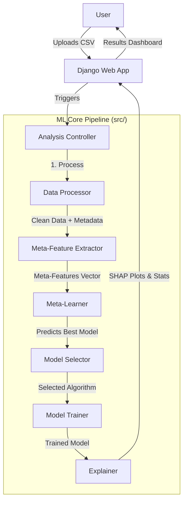

# System Architecture

The **Self-Adaptive Model Selector** is designed as a modular, pipeline-based system. It decouples the core Machine Learning logic (`src/`) from the User Interface (`webapp/`), allowing the ML engine to be used independently or integrated into other applications.

## High-Level Overview

## Core Modules (`src/`)

### 1. Data Processor (`data_processor.py`)
Responsible for the initial ingestion and understanding of the raw data.
*   **Responsibilities**:
    *   Load data (CSV/Pandas).
    *   **Problem Detection**: Automatically determines if the task is Regression or Classification (Binary/Multiclass).
    *   **Data Cleaning**: Handles missing values (imputation) and encodes categorical variables (LabelEncoding).
    *   **Metadata Extraction**: Counts rows/cols, checks for time-series traits.

### 2. Meta-Feature Extractor (`meta_features.py`)
Extracts statistical "fingerprints" of the dataset. These are used to judge which algorithm will perform best.
*   **Key Meta-Features**:
    *   **Dimensionality**: Ratio of features to samples ($N/P$).
    *   **Statistical**: Skewness, Kurtosis.
    *   **Tests**: Breusch-Pagan (heteroscedasticity), Box-Tidwell (linearity), Shapiro-Wilk (normality).
    *   **Data Quality**: Class imbalance ratio, outlier percentage, average VIF (multicollinearity).

### 3. Meta-Learner (`meta_learner.py`)
 The "Brain" of the system.
*   **Logic**: It is a purely supervised ML model (e.g., Random Forest) trained on *metadata* of many datasets.
*   **Input**: Meta-feature vector (e.g., `[skewness=0.5, imbalance=0.2, ...]`).
*   **Output**: The name of the algorithm likely to maximize performance (e.g., "XGBoost").
*   **Training**: Comes with a `MetaDatasetGenerator` to create synthetic meta-data for bootstrapping the system if no history exists.

### 4. Model Selector (`model_selector.py`)
Applies deterministic rules and filters *before* or *after* the Meta-Learner prediction.
*   **Filtering**: Excludes models that are incompatible (e.g., Linear Regression for Classification) or poor choices (e.g., avoiding SVMs on massive datasets if speed is required).

### 5. Model Trainer (`model_trainer.py`)
Handles the standard ML lifecycle for the *selected* model.
*   **Functions**:
    *   Split data (Train/Test).
    *   Hyperparameter Tuning (RandomizedSearchCV - optional but supported).
    *   Training (fit).
    *   Evaluation (predict, metrics calculation).

## Web Application (`webapp/`)

Built with **Django**, following the MVT (Model-View-Template) pattern.

*   **Views (`selector/views.py`)**:
    *   `upload_dataset`: Handles file storage (`FileSystemStorage`).
    *   `preview_dataset`: Uses Pandas `head()` to render HTML tables.
    *   `analyze_dataset`: Orchestrates the calls to the `src` modules.
*   **Session Management**: Stores the file path and target column in the user session to persist state across steps.
*   **Templates**: Uses Bootstrap for responsive, clean UI components.

## Data Flow Example

1.  **Input**: `housing_prices.csv` (Target: `Price`)
2.  **DataProcessor**: Detects `ProblemType.REGRESSION`, `n_samples=500`.
3.  **MetaFeatureExtractor**: Finds `Linearity=False` (p < 0.05), `Outliers=High`.
4.  **MetaLearner**: Input `[NonLinear, Outliers]` -> Predicts **"Random Forest Regressor"** (robust to outliers/non-linearity).
5.  **ModelTrainer**: Trains RF, achieves `R2=0.89`.
6.  **Explainer**: Calculates feature importance (e.g., `SquareFeet` is #1 predictor).
7.  **Output**: HTML Dashboard.
